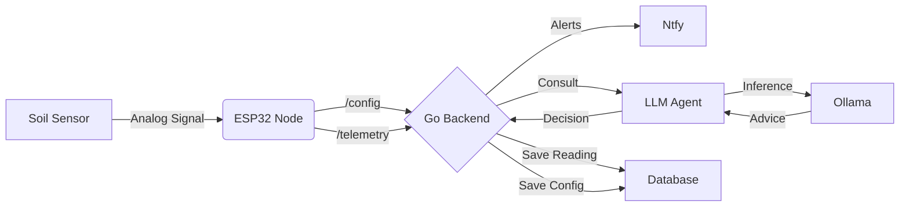

# 🌱 Seed Sentinel   

<p align="center">
  
</p>

**Seed Monitoring System**

*High tech for deep roots*

Seed Sentinel is an open-source platform designed to democratize "Nature Intelligence" by translating the silent language of plants into actionable insights. Combining low-cost, distributed soil telemetry with an adaptive AI botanist, the system monitors real-time environmental conditions and compares them against species-specific needs—whether you are growing rare native prairie flowers or backyard vegetables. By replacing guesswork with data-driven guidance, Seed Sentinel lowers the barrier to ecological restoration, empowering anyone to successfully grow any seed and deepen their connection to the natural world without proprietary lock-in.

## 🏗 Architecture

The system follows a **Microservices** architecture designed for local privacy and resilience:

1.  **The Node:** An ESP32 microcontroller reading raw capacitance values from a soil moisture sensor.
2.  **The Backend (Orchestrator):** A high-concurrency **Go (Golang)** server that ingests telemetry, manages configuration, and handles notifications.
3.  **The LLM Agent (Brain):** A Python microservice that interfaces with a local LLM (via **Ollama**) to interpret data and generate "Grow Profiles."



## ⚡ Quick Start Guide (Mac / Linux)

### 1. Automated Setup
Use the provided setup script to install Ollama, the Llama 3 model, uv, and all dependencies automatically.

``` bash
sudo chmod +x scripts/setup.sh
./scripts/setup.sh
```

### 2. Notification Setup (.env & Ntfy)
Seed Sentinel uses Ntfy.sh for free, instant push notifications to your phone. No account required.

  - Download [Ntfy.sh](https://ntfy.sh/) on your mobile device
  - Pick a Topic Name: Choose a unique topic name (e.g., seed-sentinel-YOURNAME). Note: This topic is public, so use a unique random string if you want privacy.
  - Configure the Backend: Create a new file named .env inside the backend/ folder:

```
NOTIFICATION_TOPIC=seed-sentinel-YOURNAME
```

### 3. Running the System

``` bash
cd backend
go run main.go
```

``` bash
cd llm-agent
uv run main.py
```
