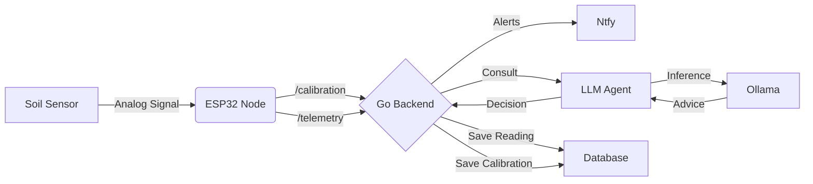

# 🌱 Seed Sentinel


[](https://www.sqlite.org/)


<p align="center">
  
</p>

**Seed Monitoring System**

*High tech for deep roots*

Seed Sentinel is an open-source platform that translates plant signals into actionable insights. By combining affordable soil sensors with an AI botanist, it monitors real-time conditions and compares them to each plant’s needs. This data-driven approach empowers anyone to grow seeds successfully and restore ecosystems—without proprietary barriers.

## 📂 Project Ecosystem

The system is split into two repositories to separate the "Bits" from the "Atoms":

| Repository | Description | Tech Stack |
| :--- | :--- | :--- |
| **[seed-sentinel](https://github.com/nick-moyer/seed-sentinel)** | **The Hub (This Repo)**<br>Contains the Go Backend, Database, and Python AI Agent. | Go, Python, SQLite, Ollama |
| **[seed-sentinel-device](https://github.com/nick-moyer/seed-sentinel-device)** | **The Node**<br>Contains the ESP32 Firmware, Circuit Schematics, and 3D CAD files. | C++, PlatformIO, FreeCAD |


## 🏗 Architecture

The system follows a **Microservices** architecture designed for local privacy and resilience:

1.  **The Node:** An ESP32 microcontroller reading raw capacitance values from a soil moisture sensor.
2.  **The Backend (Orchestrator):** A high-concurrency **Go (Golang)** server that ingests telemetry, manages configuration, and handles notifications.
3.  **The LLM Agent (Brain):** A Python microservice that interfaces with a local LLM (via **Ollama**) to interpret data and generate "Grow Profiles."



## ⚡ Quick Start Guide (Mac / Linux)

### 1. Automated Setup
Use the provided setup script to install Ollama, the Llama 3 model, uv, and all dependencies automatically.

``` bash
sudo chmod +x scripts/setup.sh
./scripts/setup.sh
```

### 2. Notification Setup (.env & Ntfy)
Seed Sentinel uses Ntfy.sh for free, instant push notifications to your phone. No account required.

  - Download [Ntfy.sh](https://ntfy.sh/) on your mobile device
  - Pick a Topic Name: Choose a unique topic name (e.g., seed-sentinel-YOURNAME). Note: This topic is public, so use a unique random string if you want privacy.
  - Configure the Backend: Create a new file named .env inside the backend/ folder:

```
NOTIFICATION_TOPIC=seed-sentinel-YOURNAME
```

### 3. Running the System

``` bash
cd backend
go run main.go
```

``` bash
cd llm-agent
uv run main.py
```

## 🔌 Hardware Setup
To build the physical node, please visit the [seed-sentinel-device](https://github.com/nick-moyer/seed-sentinel-device) repository.

Brief BOM Overview:
- ESP32 Development Board (ESP-WROOM-32)
- Capacitive Soil Moisture Sensor v1.2
- USB-C Cable for power/data


## 🧪 Testing the Loop
You don't need the hardware to test the software stack. You can simulate the hardware using cURL or Postman.

1. Register a New Device (Provisioning)

``` bash
curl -X POST http://localhost:8080/config \
     -H "Content-Type: application/json" \
     -d '{"mac_address": "AA:BB:CC:DD:EE:FF", "plant_name": "Tomato"}'
```

2. Simulate Telemetry

``` bash
curl -X POST http://localhost:8080/telemetry \
     -H "Content-Type: application/json" \
     -d '{"sensor_id": "AA:BB:CC:DD:EE:FF", "moisture": 15}'
```

Expected Result:
1. Go logs the request and saves to seed.db.
2. Python asks Ollama ("Is 15% moisture bad for a tomato?").
3. Ollama responds "Yes, critical."
4. Your phone buzzes (via Ntfy) with the alert.